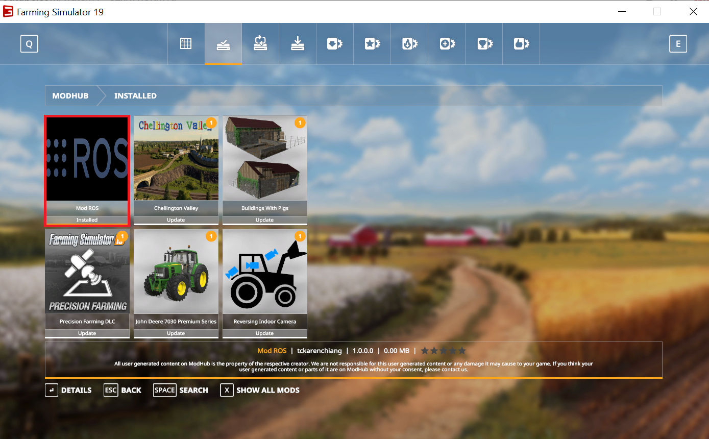

# FS19_modROS

## Overview

This mod for Farming Simulator 2019 allows autonomous driving of FarmSim vehicles with the ROS navigation stack.

The mod itself is hosted in this repository.
[tud-cor/fs_mod_ros_windows](https://github.com/tud-cor/fs_mod_ros_windows) contains the companion Python scripts which implement a bridge between `modROS` and ROS 1 (using `rospy`).
[tud-cor/fs_mod_ros](https://github.com/tud-cor/fs_mod_ros) contains two example ROS packages which show how to interact with FarmSim19 running `modROS`.


## Status

Some parts are still under development.


## Requirements

* Windows 10
* Farming Simulator 19

Both the Steam version of Farming Simulator and the version distributed as a stand-alone purchase have been tested.


## Building

#### Installing the mod in Farming Simulator 19

__Note: The following instructions assume the default paths to various system folders are used on your machine. If not, please update the paths in the relevant places.__

1. Clone the mod or download the `.zip` at any location

    ```cmd
    git clone https://github.com/tud-cor/FS19_modROS modROS
    ```

2. Moving mod files to the `mods` directory: 
In order for FarmSim to detect `modROS`, you either have to move the folder [modROS](https://github.com/tud-cor/FS19_modROS) to the `mods` directory (`%USERPROFILE%\Documents\My Games\FarmingSimulator2019\mods`) or create a symbolic link from the `modROS` folder and drop it in the `FarmingSimulator2019\mods` directory.

    The authors have used [hardlinkshellext/linkshellextension](https://schinagl.priv.at/nt/hardlinkshellext/linkshellextension.html) which makes this an easy process.

3. If you've sucessfully installed the mod, it should be listed on the *Installed* tab of the *Mods* section in FarmSim (`modROS` is shown with a red square):

    

    More information on installing mods in Farming Simulator 2019 can be found [here](http://www.farmingsimulator19mods.com/how-to-install-farming-simulator-2019-19-mods/).

4. Enable the Developer Console in Farming Simulator. Tutorial can be found [here](https://www.youtube.com/watch?v=_hYbnu6nJsQ).


#### ROS nodes in Windows
To start transmitting messages between Farmsim and ROS, please first go to [fs_mod_ros_windows](https://github.com/tud-cor/fs_mod_ros_windows). 

#### Optional
If you would like to have a simulated RGB camera (not required to run navigation stack in ROS) in Farsmsim using screen capture, please refer to [`d3dshot_screen_grabber`](https://github.com/tud-cor/d3dshot_screen_grabber) 


## Running

To pubslish data, you need to first run a ROS node-`all_in_one_publisher.py`. Please follow the instructions [here](https://github.com/tud-cor/fs_mod_ros_windows#publishing-data).

**Note: Before proceeding to the next step, make sure you see *waiting for client from FarmSim19* in the cmd window**


Open Farming Simulator 19 and switch the in-game console to command mode by pressing the tilde key (<kbd>~</kbd>) twice. More information on how to use console command in game can be found [here](https://wiki.nitrado.net/en/Admin_Commands_for_Farming_Simulator_19).


To publish data, execute the following command in the FarmSim console:

```
rosPubMsg true
```

If you want to stop publishing data, simply execute:

```
rosPubMsg false
```


#### Subscribing data

Please follow the instructions [here](https://github.com/tud-cor/fs_mod_ros_windows#subscribing-data) to run the ROS node- `cm_vel_subscriber.py` first.


To give control of the manned vehicle to ROS, execute the following command in the FarmSim console:

```
rosControlVehicle true
```

If you want to stop subscribing and gain control back in FarmSim, so you can drive around the farm yourself:

```
rosControlVehicle false
```

#### Optional
Force-center the camera if you use [`d3dshot_screen_grabber`](https://github.com/tud-cor/d3dshot_screen_grabber) to get a simulated RGB camera.

This command is used to fix the camera view while capturing the screen. In FarmSim, the camera view is dynamic when one moves the cursor. In order to simulate the rgb sensor, the camera view should be fixed at one angle as it is mounted on the vehicle.

To force-center the current camera, execute the following command in the FarmSim console:

```
forceCenteredCamera true
```

Stop forcing the camera:

```
forceCenteredCamera false
```

#### ROS Navigation stack
Once you have all the required components, please refer to [fs_mod_ros](https://github.com/tud-cor/fs_mod_ros) to run ROS navigation stack on Linux.
